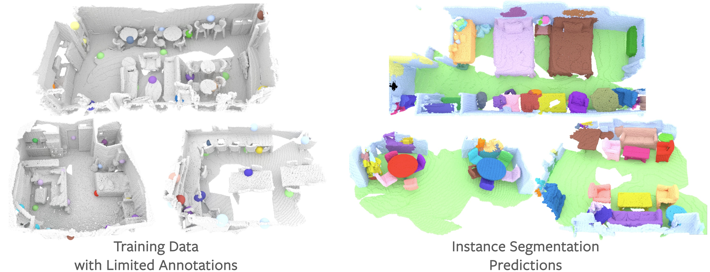

# Exploring Data-Efficient 3D Scene Understanding with Contrastive Scene Contexts



The rapid progress in 3D scene understanding has come with growing demand for data; however, collecting and annotating 3D scenes (e.g. point clouds) are notoriously hard. For example, the number of scenes (e.g. indoor rooms) that can be accessed and scanned might be limited; even given sufficient data, acquiring 3D labels (e.g. instance masks) requires intensive human labor. In this paper, we explore data-efficient learning for 3D point cloud. As a first step towards this direction, we propose Contrastive Scene Contexts, a 3D pre-training method that makes use of both point-level correspondences and spatial contexts in a scene. Our method achieves state-of-the-art results on a suite of benchmarks where training data or labels are scarce. Our study reveals that exhaustive labelling of 3D point clouds might be unnecessary; and remarkably, on ScanNet, even using 0.1% of point labels, we still achieve 89% (instance segmentation) and 96% (semantic segmentation) of the baseline performance that uses full annotations.


[[CVPR 2021 Paper]](https://arxiv.org/abs/2012.09165) [[Video]](https://www.youtube.com/watch?v=E70xToZLgs4&t=1s) [[Project Page]](https://sekunde.github.io/project_efficient/) [[ScanNet Data-Efficient Benchmark]](http://kaldir.vc.in.tum.de/scannet_benchmark/data_efficient/about)

## Environment
This codebase was tested with the following environment configurations.
- Ubuntu 20.04
- CUDA 10.2
- GCC 7.3.0
- Python 3.7.7
- PyTorch 1.5.1
- [MinkowskiEngine](https://github.com/stanfordvl/MinkowskiEngine) v0.4.3 


## Installation

We use conda for the installation process:
```
# Install virtual env and PyTorch
conda create -n sparseconv043 python=3.7
conda activate sparseconv043
conda install pytorch==1.5.1 torchvision==0.6.1 cudatoolkit=10.2 -c pytorch

# Complie and install MinkowskiEngine 0.4.3.
conda install mkl mkl-include -c intel
wget https://github.com/NVIDIA/MinkowskiEngine/archive/refs/tags/v0.4.3.zip
cd MinkowskiEngine-0.4.3 
python setup.py install
```

Next, download Contrastive Scene Contexts git repository and install the requirement from the root directory.

```
git clone https://github.com/facebookresearch/ContrastiveSceneContexts.git
cd ContrastiveSceneContexts
pip install -r requirements.txt
```


Our code also depends on [PointGroup](https://github.com/Jia-Research-Lab/PointGroup) and [PointNet++](https://github.com/erikwijmans/Pointnet2_PyTorch).
```
# Install OPs in PointGroup by:
conda install -c bioconda google-sparsehash
cd downstream/semseg/lib/bfs/ops
python setup.py build_ext --include-dirs=YOUR_ENV_PATH/include
python setup.py install

# Install PointNet++
cd downstream/votenet/models/backbone/pointnet2
python setup.py install
```

## Pre-training on ScanNet

### Data Pre-processing

For pre-training, one can generate ScanNet Pair data by following code (need to change the TARGET and SCANNET_DIR accordingly in the script). 

```
cd pretrain/scannet_pair
./preprocess.sh
```
This piece of code first extracts pointcloud from partial frames, and then computes a filelist of overlapped partial frames for each scene. 
Generate a combined txt file called *overlap30.txt* of filelists of each scene by running the code
```
cd pretrain/scannet_pair
python generate_list.py --target_dir TARGET
```
This *overlap30.txt* should be put into folder *TARGET/splits*.

### Pre-training
Our codebase enables multi-gpu training with distributed data parallel (DDP) module in pytorch. 
To train PointContrast with 8 GPUs (batch_size=32, 4 per GPU) on a single server:

```
cd pretrain/contrastive_scene_contexts
# Pretrain with SparseConv backbone
OUT_DIR=./output DATASET=ROOT_PATH_OF_DATA scripts/pretrain_sparseconv.sh
# Pretrain with PointNet++ backbone
OUT_DIR=./output DATASET=ROOT_PATH_OF_DATA scripts/pretrain_pointnet2.sh
```

## ScanNet Downstream Tasks

### Data Pre-Processing
We provide the code for pre-processing the data for ScanNet downstream tasks. One can run following code to generate the training data for semantic segmentation and instance segmentation.
```
# Edit path variables, SCANNET_OUT_PATH
cd downstream/semseg/lib/datasets/preprocessing
python scannet.py
```
For ScanNet detection data generation, please refer to [VoteNet ScanNet Data](https://github.com/facebookresearch/votenet/tree/master/scannet). Run command to soft link the generated detection data (located in PATH_DET_DATA) to following location:

```
# soft link detection data
cd downstream/det/
ln -s PATH_DET_DATA datasets/scannet/scannet_train_detection_data
```

For Data-Efficient Learning, download the *scene_list* and *points_list* as well as *bbox_list* from [ScanNet Data-Efficient Benchmark](http://kaldir.vc.in.tum.de/scannet_benchmark/data_efficient/documentation#submission-policy). To **Active Selection** for *points_list*, run following code:
```
# Get features per point
cd downstream/semseg/
DATAPATH=SCANNET_DATA LOG_DIR=./output PRETRAIN=PATH_CHECKPOINT ./scripts/inference_features.sh
# run k-means on feature space
cd lib
python sampling_points.py --point_data SCANNET_OUT_PATH --feat_data PATH_CHECKPOINT
```

### Semantic Segmentation
We provide code for the semantic segmentation experiments conducted in our paper. Our code supports **multi-gpu training**. To train with 8 GPUs on a single server, 
```
# Edit relevant path variables and then run:
cd downstream/semseg/
DATAPATH=SCANNET_OUT_PATH LOG_DIR=./output PRETRAIN=PATH_CHECKPOINT ./scripts/train_scannet.sh
```

For **Limited Scene Reconstruction**, run following code:
```
# Edit relevant path variables and then run:
cd downstream/semseg/
DATAPATH=SCANNET_OUT_PATH LOG_DIR=./output PRETRAIN=PATH_CHECKPOINT TRAIN_FILE=PATH_SCENE_LIST ./scripts/data_efficient/by_scenes.sh
```

For **Limited Points Annotation**, run following code:
```
# Edit relevant path variables and then run:
cd downstream/semseg/
DATAPATH=SCANNET_OUT_PATH LOG_DIR=./output PRETRAIN=PATH_CHECKPOINT SAMPLED_INDS=PATH_SCENE_LIST ./scripts/data_efficient/by_points.sh
```

#### Model Zoo
We also provide our pre-trained checkpoints (and log file) for reference. You can evalutate our pre-trained model by running code:
```
# PATH_CHECKPOINT points to downloaded pre-trained model path:
cd downstream/semseg/
DATAPATH=SCANNET_OUT_PATH LOG_DIR=./output PRETRAIN=PATH_CHECKPOINT ./scripts/test_scannet.sh
```

| Training Data | mIoU (val) | Initialization                  | Pre-trained Model                       | Logs                                 | Tensorboard   |
|---------------|------------|---------------------------------|-----------------------------------------|--------------------------------------|------------------------------------------|
| 1% scenes     | 29.3       | [download][partition8_4096_60k] | [download][scannet_sem_scene1_weight]   | [link][scannet_sem_scene1_log]   | [link][scannet_sem_scene1_20_tensorboard]   |
| 5% scenes     | 45.4       | [download][partition8_4096_60k] | [download][scannet_sem_scene5_weight]   | [link][scannet_sem_scene5_log]   | [link][scannet_sem_scene1_20_tensorboard]   |
| 10% scenes    | 59.5       | [download][partition8_4096_60k] | [download][scannet_sem_scene10_weight]  | [link][scannet_sem_scene10_log]  | [link][scannet_sem_scene1_20_tensorboard]  |
| 20% scenes    | 64.1       | [download][partition8_4096_60k] | [download][scannet_sem_scene20_weight]  | [link][scannet_sem_scene20_log]  | [link][scannet_sem_scene1_20_tensorboard]  |
| 100% scenes   | 73.8       | [download][partition8_4096_100k] | [download][scannet_sem_scene100_weight] | [link][scannet_sem_scene100_log] | [link][scannet_sem_scene100_tensorboard] |
| 20 points     | 53.8       | [download][partition8_4096_60k] | [download][scannet_sem_point20_weight]  | [link][scannet_sem_point20_log]  | [link][scannet_sem_point20_200_tensorboard]  |
| 50 points     | 62.9       | [download][partition8_4096_60k] | [download][scannet_sem_point50_weight]  | [link][scannet_sem_point50_log]  | [link][scannet_sem_point20_200_tensorboard]  |
| 100 points    | 66.9       | [download][partition8_4096_60k] | [download][scannet_sem_point100_weight] | [link][scannet_sem_point100_log] | [link][scannet_sem_point20_200_tensorboard] |
| 200 points    | 69.0       | [download][partition8_4096_60k] | [download][scannet_sem_point200_weight] | [link][scannet_sem_point200_log] | [link][scannet_sem_point20_200_tensorboard] |

### Instance Segmentation
We provide code for the instance segmentation experiments conducted in our paper. Our code supports **multi-gpu training**. To train with 8 GPUs on a single server, 
```
# Edit relevant path variables and then run:
cd downstream/insseg/
DATAPATH=SCANNET_OUT_PATH LOG_DIR=./output PRETRAIN=PATH_CHECKPOINT ./scripts/train_scannet.sh
```
For **Limited Scene Reconstruction**, run following code:
```
# Edit relevant path variables and then run:
cd downstream/insseg/
DATAPATH=SCANNET_OUT_PATH LOG_DIR=./output PRETRAIN=PATH_CHECKPOINT TRAIN_FILE=PATH_SCENE_LIST ./scripts/data_efficient/by_scenes.sh
```

For **Limited Points Annotation**, run following code:
```
# Edit relevant path variables and then run:
cd downstream/insseg/
DATAPATH=SCANNET_OUT_PATH LOG_DIR=./output PRETRAIN=PATH_CHECKPOINT SAMPLED_INDS=PATH_POINTS_LIST ./scripts/data_efficient/by_points.sh
```

For **ScanNet Benchmark**, run following code (train on train+val and evaluate on val):
```
# Edit relevant path variables and then run:
cd downstream/insseg/
DATAPATH=SCANNET_OUT_PATH LOG_DIR=./output PRETRAIN=PATH_CHECKPOINT ./scripts/train_scannet_benchmark.sh
```

#### Model Zoo
We provide our pre-trained checkpoints (and log file) for reference. You can evalutate our pre-trained model by running code:
```
# PATH_CHECKPOINT points to pre-trained model path:
cd downstream/insseg/
DATAPATH=SCANNET_DATA LOG_DIR=./output PRETRAIN=PATH_CHECKPOINT ./scripts/test_scannet.sh
```

For submitting to ScanNet Benchmark with our pre-trained model, run following command (the submission file is located in output/benchmark_instance):
```
# PATH_CHECKPOINT points to pre-trained model path:
cd downstream/insseg/
DATAPATH=SCANNET_DATA LOG_DIR=./output PRETRAIN=PATH_CHECKPOINT ./scripts/test_scannet_benchmark.sh
```


| Training Data    | mAP@0.5 (val)        | Initialization                        | Pre-trained Model                    | Logs                              | Curves                                   |
|---------------|---------------------|-----------------------------|--------------------------------------|-----------------------------------|-------------------------------------------|
| 1% scenes     | 12.3                | [download][partition8_4096_60k] | [download][scannet_ins_scene1_weight]    | [link][scannet_ins_scene1_log]    | [link][scannet_ins_scene1_20_tensorboard]    |
| 5% scenes     | 33.9                | [download][partition8_4096_60k] | [download][scannet_ins_scene5_weight]    | [link][scannet_ins_scene5_log]    | [link][scannet_ins_scene1_20_tensorboard]    |
| 10% scenes    | 45.3                | [download][partition8_4096_60k] | [download][scannet_ins_scene10_weight]   | [link][scannet_ins_scene10_log]   | [link][scannet_ins_scene1_20_tensorboard]   |
| 20% scenes    | 49.8                | [download][partition8_4096_60k] | [download][scannet_ins_scene20_weight]   | [link][scannet_ins_scene20_log]   | [link][scannet_ins_scene1_20_tensorboard]   |
| 100% scenes   | 59.4                | [download][partition8_4096_60k] | [download][scannet_ins_scene100_weight]  | [link][scannet_ins_scene100_log]  | [link][scannet_ins_scene100_tensorboard]  |
| 20 points     | 27.2                | [download][partition8_4096_60k] | [download][scannet_ins_point20_weight]   | [link][scannet_ins_point20_log]   | [link][scannet_ins_point20_200_tensorboard]   |
| 50 points     | 35.7                | [download][partition8_4096_60k] | [download][scannet_ins_point50_weight]   | [link][scannet_ins_point50_log]   | [link][scannet_ins_point20_200_tensorboard]   |
| 100 points    | 43.6                | [download][partition8_4096_60k] | [download][scannet_ins_point100_weight]  | [link][scannet_ins_point100_log]  | [link][scannet_ins_point20_200_tensorboard]  |
| 200 points    | 50.4                | [download][partition8_4096_60k] | [download][scannet_ins_point200_weight]  | [link][scannet_ins_point200_log]  | [link][scannet_ins_point20_200_tensorboard]  |
| train + val   | 76.5 (64.8 on test) | [download][partition8_4096_60k] | [download][scannet_ins_benchmark_weight] | [link][scannet_ins_benchmark_log] | [link][scannet_ins_benchmark_tensorboard] |


### 3D Object Detection

We provide the code for 3D Object Detection downstream task. The code is adapted directly fron [VoteNet](https://github.com/facebookresearch/votenet). Additionally, we provide two backones, namely PointNet++ and SparseConv. To fine-tune the downstream task, run following command:
```
cd downstream/votenet/
# train sparseconv backbone
LOG_DIR=./output PRETRAIN=PATH_CHECKPOINT ./scripts/train_scannet.sh
# train pointnet++ backbone
LOG_DIR=./output PRETRAIN=PATH_CHECKPOINT ./scripts/train_scannet_pointnet.sh
```
For **Limited Scene Reconstruction**, run following code:
```
# Edit relevant path variables and then run:
cd downstream/votenet/
LOG_DIR=./output PRETRAIN=PATH_CHECKPOINT TRAIN_FILE=PATH_SCENE_LIST ./scripts/data_efficient/by_Scentrain_scannet.sh
```

For **Limited Bbox Annotation**, run following code:
```
# Edit relevant path variables and then run:
cd downstream/votenet/
DATAPATH=SCANNET_DATA LOG_DIR=./output PRETRAIN=PATH_CHECKPOINT SAMPLED_BBOX=PATH_BBOX_LIST ./scripts/data_efficient/by_bboxes.sh
```

For submitting to **[ScanNet Data-Efficient Benchmark](http://kaldir.vc.in.tum.de/scannet_benchmark/data_efficient/lr_object_detection_3d.php?percent_scenes=80percent)**, you can set "test.write_to_bencmark=True" in "downstream/votenet/scripts/test_scannet.sh" or "downstream/votenet/scripts/test_scannet_pointnet.sh"

#### Model Zoo
We provide our pre-trained checkpoints (and log file) for reference. You can evaluate our pre-trained model by running following code.

```
# PATH_CHECKPOINT points to pre-trained model path:
cd downstream/votenet/
LOG_DIR=./output PRETRAIN=PATH_CHECKPOINT ./scripts/test_scannet.sh
```

| Training Data           | mAP@0.5 (val)| mAP@0.25 (val)| Initialize                                 | Pre-trained Model                            |  Logs                                     | Curves                                           |
|-------------------------|-------------|--------------|--------------------------------------|----------------------------------------------|-------------------------------------------|---------------------------------------------------|
| 10% scenes              | 9.9         | 24.7         | [download][partition8_4096_60k]          | [download][scannet_det_scene10_weight]           | [link][scannet_det_scene10_log]           |[link][scannet_det_scene10_tensorboard]            |
| 20% scenes              | 21.4        | 41.4         | [download][partition8_4096_60k]          | [download][scannet_det_scene20_weight]           | [link][scannet_det_scene20_log]           |[link][scannet_det_scene20_tensorboard]            |
| 40% scenes              | 29.5        | 52.0         | [download][partition8_4096_60k]          | [download][scannet_det_scene40_weight]           | [link][scannet_det_scene40_log]           |[link][scannet_det_scene40_tensorboard]            |
| 80% scenes              | 36.3        | 56.3         | [download][partition8_4096_60k]          | [download][scannet_det_scene80_weight]           | [link][scannet_det_scene80_log]           |[link][scannet_det_scene80_tensorboard]            |
| 100% scenes             | 39.3        | 59.1         | [download][partition4_4096_100k]          | [download][scannet_det_scene100_weight]          | [link][scannet_det_scene100_log]          |[link][scannet_det_scene100_tensorboard]           |
| 100% scenes (PointNet++)| 39.2        | 62.5         | [download][partition8_4096_15k_pointnet2]| [download][scannet_det_scene100_weight_pointnet2]| [link][scannet_det_scene100_log_pointnet2]|[link][scannet_det_scene100_tensorboard_pointnet2] |
| 1 bboxes                | 30.3        | 54.5         | [download][partition8_4096_60k]          | [download][scannet_det_bbox1_weight]             | [link][scannet_det_bbox1_log]             |[link][scannet_det_bbox1_tensorboard]              |
| 2 bboxes                | 32.4        | 55.3         | [download][partition8_4096_60k]          | [download][scannet_det_bbox2_weight]             | [link][scannet_det_bbox2_log]             |[link][scannet_det_bbox2_tensorboard]              |
| 4 bboxes                | 34.6        | 58.9         | [download][partition8_4096_60k]          | [download][scannet_det_bbox4_weight]             | [link][scannet_det_bbox4_log]             |[link][scannet_det_bbox4_tensorboard]              |
| 7 bboxes                | 35.9        | 59.7         | [download][partition8_4096_60k]          | [download][scannet_det_bbox7_weight]             | [link][scannet_det_bbox7_log]             |[link][scannet_det_bbox7_tensorboard]              |


## Stanford 3D (S3DIS) Fine-tuning

### Data Pre-Processing
We provide the code for pre-processing the data for Stanford3D (S3DIS) downstream tasks. One can run following code to generate the training data for semantic segmentation and instance segmentation.
```
# Edit path variables, STANFORD_3D_OUT_PATH
cd downstream/semseg/lib/datasets/preprocessing
python stanford.py
```

### Semantic Segmentation

We provide code for the semantic segmentation experiments conducted in our paper. Our code supports **multi-gpu training**. To fine-tune with 8 GPUs on a single server, 

```
# Edit relevant path variables and then run:
cd downstream/semseg/
DATAPATH=STANFORD_3D_OUT_PATH LOG_DIR=./output PRETRAIN=PATH_CHECKPOINT ./scripts/train_stanford3d.sh
```

#### Model Zoo

We provide our pre-trained model and log file for reference. You can evalutate our pre-trained model by running code:
```
# PATH_CHECKPOINT points to pre-trained model path:
cd downstream/semseg/
DATAPATH=STANFORD_3D_OUT_PATH LOG_DIR=./output PRETRAIN=PATH_CHECKPOINT ./scripts/test_stanford3d.sh
```
| Training Data   | mIoU (val) | Initialization                 |  Pre-trained Model              |Logs                        | Tensorboard                          |
|-----------------|------------|--------------------------------|---------------------------------|----------------------------|--------------------------------------|
| 100% scenes     | 72.2       |[download][partition8_4096_20k] | [download][stanford_sem_weight] |[link][stanford_sem_log]| [link][stanford_sem_tensorboard]|

###  Instance Segmentation

We provide code for the instance segmentation experiments conducted in our paper. Our code supports **multi-gpu training**. To fine-tune with 8 GPUs on a single server, 

```
# Edit relevant path variables and then run:
cd downstream/insseg/
DATAPATH=STANFORD_3D_OUT_PATH LOG_DIR=./output PRETRAIN=PATH_CHECKPOINT ./scripts/train_stanford3d.sh
```

#### Model Zoo

We provide our pre-trained model and log file for reference. You can evaluate our pre-trained model by running code:
```
# PATH_CHECKPOINT points to pre-trained model path:
cd downstream/insseg/
DATAPATH=STANFORD_3D_OUT_PATH LOG_DIR=./output PRETRAIN=PATH_CHECKPOINT ./scripts/test_stanford3d.sh
```
| Training Data     | mAP@0.5 (val)     | Initialization                  |  Pre-trained Model              |Logs                         | Tensorboard                         |
|-------------------|-------------------|---------------------------------|---------------------------------|-----------------------------|-------------------------------------|
| 100% scenes       | 63.4              | [download][partition8_4096_20k] | [download][stanford_ins_weight] |[link][stanford_ins_log] | [link][stanford_ins_tensorboard]|

## SUN-RGBD Fine-tuning

### Data Pre-Processing

For SUN-RGBD detection data generation, please refer to [VoteNet SUN-RGBD Data](https://github.com/facebookresearch/votenet/tree/master/sunrgbd). To soft link generated SUN-RGBD detection data (SUN_RGBD_DATA_PATH) to following location, run the command:

```
cd downstream/det/datasets/sunrgbd
# soft link 
link -s SUN_RGBD_DATA_PATH/sunrgbd_pc_bbox_votes_50k_v1_train sunrgbd_pc_bbox_votes_50k_v1_train
link -s SUN_RGBD_DATA_PATH/sunrgbd_pc_bbox_votes_50k_v1_val sunrgbd_pc_bbox_votes_50k_v1_val
```

### 3D Object Detection

We provide the code for 3D Object Detection downstream task. The code is adapted directly fron [VoteNet](https://github.com/facebookresearch/votenet). To fine-tune the downstream task, run following code:

```
# Edit relevant path variables and then run:
cd downstream/votenet/
LOG_DIR=./output PRETRAIN=PATH_CHECKPOINT ./scripts/train_sunrgbd.sh
```

#### Model Zoo
We provide our pre-trained checkpoints (and log file) for reference. You can load our pre-trained model by setting the pre-trained model path to PATH_CHECKPOINT.
```
# PATH_CHECKPOINT points to pre-trained model path:
cd downstream/votenet/
LOG_DIR=./output PRETRAIN=PATH_CHECKPOINT ./scripts/test_sunrgbd.sh
```

| Training Data  | mAP@0.5 (val)      | mAP@0.25 (val)     | Initialize                            | Pre-trained Model                  |  Log                       | Curve                              |
|----------------|-------------------|-------------------|----------------------------------|------------------------------------|-----------------------------|------------------------------------| 
| 100% scenes    | 36.4              |    58.9           | [download][partition4_4096_100k] | [download][sunrgbd_det_weight]     | [link][sunrgbd_det_log] |[link][sunrgbd_det_tensorboard] |


## Citing our paper
```
@article{hou2020exploring,
  title={Exploring Data-Efficient 3D Scene Understanding with Contrastive Scene Contexts},
  author={Hou, Ji and Graham, Benjamin and Nie{\ss}ner, Matthias and Xie, Saining},
  journal={arXiv preprint arXiv:2012.09165},
  year={2020}
}
```

## License
Contrastive Scene Contexts is relased under the MIT License. See the LICENSE file for more details.


[partition8_4096_15k_pointnet2]: http://kaldir.vc.in.tum.de/3dsis/contrastive_scene_contexts/pretrain/partition8_4096_15k_pointnet.pth
[partition8_4096_100k]:          http://kaldir.vc.in.tum.de/3dsis/contrastive_scene_contexts/pretrain/partition8_4096_100k.pth
[partition8_4096_60k]:           http://kaldir.vc.in.tum.de/3dsis/contrastive_scene_contexts/pretrain/partition8_4096_60k.pth
[partition8_4096_20k]:           http://kaldir.vc.in.tum.de/3dsis/contrastive_scene_contexts/pretrain/partition8_4096_20k.pth
[partition4_4096_100k]:          http://kaldir.vc.in.tum.de/3dsis/contrastive_scene_contexts/pretrain/partition4_4096_100k.pth

[scannet_sem_scene1_log]:   http://kaldir.vc.in.tum.de/3dsis/contrastive_scene_contexts/finetune/scannet_semseg/scene1/log.txt
[scannet_sem_scene5_log]:   http://kaldir.vc.in.tum.de/3dsis/contrastive_scene_contexts/finetune/scannet_semseg/scene5/log.txt
[scannet_sem_scene10_log]:  http://kaldir.vc.in.tum.de/3dsis/contrastive_scene_contexts/finetune/scannet_semseg/scene10/log.txt
[scannet_sem_scene20_log]:  http://kaldir.vc.in.tum.de/3dsis/contrastive_scene_contexts/finetune/scannet_semseg/scene20/log.txt
[scannet_sem_scene100_log]: http://kaldir.vc.in.tum.de/3dsis/contrastive_scene_contexts/finetune/scannet_semseg/scene100/log.txt

[scannet_sem_scene1_weight]:   http://kaldir.vc.in.tum.de/3dsis/contrastive_scene_contexts/finetune/scannet_semseg/scene1/checkpoint_NoneRes16UNet34Cbest_val.pth
[scannet_sem_scene5_weight]:   http://kaldir.vc.in.tum.de/3dsis/contrastive_scene_contexts/finetune/scannet_semseg/scene5/checkpoint_NoneRes16UNet34Cbest_val.pth
[scannet_sem_scene10_weight]:  http://kaldir.vc.in.tum.de/3dsis/contrastive_scene_contexts/finetune/scannet_semseg/scene10/checkpoint_NoneRes16UNet34Cbest_val.pth
[scannet_sem_scene20_weight]:  http://kaldir.vc.in.tum.de/3dsis/contrastive_scene_contexts/finetune/scannet_semseg/scene20/checkpoint_NoneRes16UNet34Cbest_val.pth
[scannet_sem_scene100_weight]: http://kaldir.vc.in.tum.de/3dsis/contrastive_scene_contexts/finetune/scannet_semseg/scene100/checkpoint_NoneRes16UNet34C.pth


[scannet_sem_point20_log]:  http://kaldir.vc.in.tum.de/3dsis/contrastive_scene_contexts/finetune/scannet_semseg/point20/log.txt
[scannet_sem_point50_log]:  http://kaldir.vc.in.tum.de/3dsis/contrastive_scene_contexts/finetune/scannet_semseg/point50/log.txt
[scannet_sem_point100_log]: http://kaldir.vc.in.tum.de/3dsis/contrastive_scene_contexts/finetune/scannet_semseg/point100/log.txt
[scannet_sem_point200_log]: http://kaldir.vc.in.tum.de/3dsis/contrastive_scene_contexts/finetune/scannet_semseg/point200/log.txt

[scannet_sem_point20_weight]:  http://kaldir.vc.in.tum.de/3dsis/contrastive_scene_contexts/finetune/scannet_semseg/point20/checkpoint_NoneRes16UNet34Cbest_val.pth
[scannet_sem_point50_weight]:  http://kaldir.vc.in.tum.de/3dsis/contrastive_scene_contexts/finetune/scannet_semseg/point50/checkpoint_NoneRes16UNet34Cbest_val.pth
[scannet_sem_point100_weight]: http://kaldir.vc.in.tum.de/3dsis/contrastive_scene_contexts/finetune/scannet_semseg/point100/checkpoint_NoneRes16UNet34Cbest_val.pth
[scannet_sem_point200_weight]: http://kaldir.vc.in.tum.de/3dsis/contrastive_scene_contexts/finetune/scannet_semseg/point200/checkpoint_NoneRes16UNet34Cbest_val.pth

[scannet_ins_scene1_log]:   http://kaldir.vc.in.tum.de/3dsis/contrastive_scene_contexts/finetune/scannet_insseg/scene1/log.txt
[scannet_ins_scene5_log]:   http://kaldir.vc.in.tum.de/3dsis/contrastive_scene_contexts/finetune/scannet_insseg/scene5/log.txt
[scannet_ins_scene10_log]:  http://kaldir.vc.in.tum.de/3dsis/contrastive_scene_contexts/finetune/scannet_insseg/scene10/log.txt
[scannet_ins_scene20_log]:  http://kaldir.vc.in.tum.de/3dsis/contrastive_scene_contexts/finetune/scannet_insseg/scene20/log.txt
[scannet_ins_scene100_log]: http://kaldir.vc.in.tum.de/3dsis/contrastive_scene_contexts/finetune/scannet_insseg/scene100/log.txt

[scannet_ins_scene1_weight]:   http://kaldir.vc.in.tum.de/3dsis/contrastive_scene_contexts/finetune/scannet_insseg/scene1/checkpoint_NoneRes16UNet34Cbest_val.pth
[scannet_ins_scene5_weight]:   http://kaldir.vc.in.tum.de/3dsis/contrastive_scene_contexts/finetune/scannet_insseg/scene5/checkpoint_NoneRes16UNet34C.pth
[scannet_ins_scene10_weight]:  http://kaldir.vc.in.tum.de/3dsis/contrastive_scene_contexts/finetune/scannet_insseg/scene10/checkpoint_NoneRes16UNet34C.pth
[scannet_ins_scene20_weight]:  http://kaldir.vc.in.tum.de/3dsis/contrastive_scene_contexts/finetune/scannet_insseg/scene20/checkpoint_NoneRes16UNet34Cbest_val.pth
[scannet_ins_scene100_weight]: http://kaldir.vc.in.tum.de/3dsis/contrastive_scene_contexts/finetune/scannet_insseg/scene100/checkpoint_NoneRes16UNet34Cbest_val.pth

[scannet_ins_benchmark_log]:         http://kaldir.vc.in.tum.de/3dsis/contrastive_scene_contexts/finetune/scannet_insseg/benchmark/log.txt
[scannet_ins_benchmark_weight]:      http://kaldir.vc.in.tum.de/3dsis/contrastive_scene_contexts/finetune/scannet_insseg/benchmark/checkpoint_Res16UNet34C_mAP.pth
[scannet_ins_benchmark_tensorboard]: http://kaldir.vc.in.tum.de/3dsis/contrastive_scene_contexts/finetune/scannet_insseg/benchmark/log.txt

[scannet_ins_point20_log]:  http://kaldir.vc.in.tum.de/3dsis/contrastive_scene_contexts/finetune/scannet_insseg/point20/log.txt
[scannet_ins_point50_log]:  http://kaldir.vc.in.tum.de/3dsis/contrastive_scene_contexts/finetune/scannet_insseg/point50/log.txt
[scannet_ins_point100_log]: http://kaldir.vc.in.tum.de/3dsis/contrastive_scene_contexts/finetune/scannet_insseg/point100/log.txt
[scannet_ins_point200_log]: http://kaldir.vc.in.tum.de/3dsis/contrastive_scene_contexts/finetune/scannet_insseg/point200/log.txt

[scannet_ins_point20_weight]:  http://kaldir.vc.in.tum.de/3dsis/contrastive_scene_contexts/finetune/scannet_insseg/point20/checkpoint_NoneRes16UNet34Cbest_val.pth
[scannet_ins_point50_weight]:  http://kaldir.vc.in.tum.de/3dsis/contrastive_scene_contexts/finetune/scannet_insseg/point50/checkpoint_NoneRes16UNet34C.pth
[scannet_ins_point100_weight]: http://kaldir.vc.in.tum.de/3dsis/contrastive_scene_contexts/finetune/scannet_insseg/point100/checkpoint_NoneRes16UNet34Cbest_val.pth
[scannet_ins_point200_weight]: http://kaldir.vc.in.tum.de/3dsis/contrastive_scene_contexts/finetune/scannet_insseg/point200/checkpoint_NoneRes16UNet34Cbest_val.pth


[scannet_det_scene10_log]:            http://kaldir.vc.in.tum.de/3dsis/contrastive_scene_contexts/finetune/scannet_det/scene10/log.txt
[scannet_det_scene20_log]:            http://kaldir.vc.in.tum.de/3dsis/contrastive_scene_contexts/finetune/scannet_det/scene20/log.txt
[scannet_det_scene40_log]:            http://kaldir.vc.in.tum.de/3dsis/contrastive_scene_contexts/finetune/scannet_det/scene40/log.txt
[scannet_det_scene80_log]:            http://kaldir.vc.in.tum.de/3dsis/contrastive_scene_contexts/finetune/scannet_det/scene80/log.txt
[scannet_det_scene100_log]:           http://kaldir.vc.in.tum.de/3dsis/contrastive_scene_contexts/finetune/scannet_det/scene100/log.txt
[scannet_det_scene100_log_pointnet2]: http://kaldir.vc.in.tum.de/3dsis/contrastive_scene_contexts/finetune/scannet_det/scene100_pointnet2/log.txt

[scannet_det_scene10_weight]:            http://kaldir.vc.in.tum.de/3dsis/contrastive_scene_contexts/finetune/scannet_det/scene10/checkpoint.tar
[scannet_det_scene20_weight]:            http://kaldir.vc.in.tum.de/3dsis/contrastive_scene_contexts/finetune/scannet_det/scene20/checkpoint.tar
[scannet_det_scene40_weight]:            http://kaldir.vc.in.tum.de/3dsis/contrastive_scene_contexts/finetune/scannet_det/scene40/checkpoint.tar
[scannet_det_scene80_weight]:            http://kaldir.vc.in.tum.de/3dsis/contrastive_scene_contexts/finetune/scannet_det/scene80/checkpoint.tar
[scannet_det_scene100_weight]:           http://kaldir.vc.in.tum.de/3dsis/contrastive_scene_contexts/finetune/scannet_det/scene100/checkpoint.tar
[scannet_det_scene100_weight_pointnet2]: http://kaldir.vc.in.tum.de/3dsis/contrastive_scene_contexts/finetune/scannet_det/scene100_pointnet2/checkpoint.tar

[scannet_det_bbox1_log]: http://kaldir.vc.in.tum.de/3dsis/contrastive_scene_contexts/finetune/scannet_det/bbox1/log.txt
[scannet_det_bbox2_log]: http://kaldir.vc.in.tum.de/3dsis/contrastive_scene_contexts/finetune/scannet_det/bbox2/log.txt
[scannet_det_bbox4_log]: http://kaldir.vc.in.tum.de/3dsis/contrastive_scene_contexts/finetune/scannet_det/bbox4/log.txt
[scannet_det_bbox7_log]: http://kaldir.vc.in.tum.de/3dsis/contrastive_scene_contexts/finetune/scannet_det/bbox7/log.txt

[scannet_det_bbox1_weight]: http://kaldir.vc.in.tum.de/3dsis/contrastive_scene_contexts/finetune/scannet_det/bbox1/checkpoint.tar
[scannet_det_bbox2_weight]: http://kaldir.vc.in.tum.de/3dsis/contrastive_scene_contexts/finetune/scannet_det/bbox2/checkpoint.tar
[scannet_det_bbox4_weight]: http://kaldir.vc.in.tum.de/3dsis/contrastive_scene_contexts/finetune/scannet_det/bbox4/checkpoint.tar
[scannet_det_bbox7_weight]: http://kaldir.vc.in.tum.de/3dsis/contrastive_scene_contexts/finetune/scannet_det/bbox7/checkpoint.tar


[stanford_sem_weight]:      http://kaldir.vc.in.tum.de/3dsis/contrastive_scene_contexts/finetune/stanford_semseg/checkpoint_NoneRes16UNet34Cbest_val.pth
[stanford_sem_log]:         http://kaldir.vc.in.tum.de/3dsis/contrastive_scene_contexts/finetune/stanford_semseg/log.txt

[stanford_ins_weight]:      http://kaldir.vc.in.tum.de/3dsis/contrastive_scene_contexts/finetune/stanford_insseg/checkpoint_Res16UNet34C_mAP.pth
[stanford_ins_log]:         http://kaldir.vc.in.tum.de/3dsis/contrastive_scene_contexts/finetune/stanford_insseg/log.txt


[sunrgbd_det_weight]:      http://kaldir.vc.in.tum.de/3dsis/contrastive_scene_contexts/finetune/sunrgbd_det/checkpoint.tar
[sunrgbd_det_log]:         http://kaldir.vc.in.tum.de/3dsis/contrastive_scene_contexts/finetune/sunrgbd_det/log.txt

[scannet_ins_scene1_tensorboard]:             https://tensorboard.dev/experiment/uAF1JmhVSYqJ4ygb6JXYDw 
[scannet_ins_scene5_tensorboard]:             https://tensorboard.dev/experiment/C6NJaBGiQgCKUpgpDSyoPA 
[scannet_ins_scene10_tensorboard]:            https://tensorboard.dev/experiment/nn2kRe2rQNOvWJTMUORdFA 
[scannet_ins_scene20_tensorboard]:            https://tensorboard.dev/experiment/cG6ieAA7Ra6wWdqjVo4ZXA 
[scannet_ins_scene100_tensorboard]:           https://tensorboard.dev/experiment/TKRqUAMLQIeblqZNktLReA 
[scannet_ins_scene1_20_tensorboard]:          https://tensorboard.dev/experiment/TnWy5F5kSJebINEDARNhLg/#scalars&_smoothingWeight=0
[scannet_ins_point20_tensorboard]:            https://tensorboard.dev/experiment/sN6lmIWGSdan2lGJuB3ASg 
[scannet_ins_point50_tensorboard]:            https://tensorboard.dev/experiment/Nwe7Ouw0Rj287XJpcYNYTg 
[scannet_ins_point100_tensorboard]:           https://tensorboard.dev/experiment/JrQDlX8JQbecPirNmNXGow 
[scannet_ins_point200_tensorboard]:           https://tensorboard.dev/experiment/XjIB6iApRDK1ixtMnqAeJw 
[scannet_ins_point20_200_tensorboard]:        https://tensorboard.dev/experiment/qqYikT8LQD2JHeKP62GRdg/#scalars&_smoothingWeight=0
[scannet_sem_point20_tensorboard]:            https://tensorboard.dev/experiment/sN6lmIWGSdan2lGJuB3ASg 
[scannet_sem_point50_tensorboard]:            https://tensorboard.dev/experiment/Nwe7Ouw0Rj287XJpcYNYTg 
[scannet_sem_point100_tensorboard]:           https://tensorboard.dev/experiment/JrQDlX8JQbecPirNmNXGow 
[scannet_sem_point200_tensorboard]:           https://tensorboard.dev/experiment/XjIB6iApRDK1ixtMnqAeJw 
[scannet_sem_point20_200_tensorboard]:        https://tensorboard.dev/experiment/xMwdcvdJQSyC6eb1Adx7aw/#scalars&_smoothingWeight=0
[scannet_sem_scene1_tensorboard]:             https://tensorboard.dev/experiment/JSgrRG4dQ3uEn1xqhNpwAw 
[scannet_sem_scene5_tensorboard]:             https://tensorboard.dev/experiment/C6NJaBGiQgCKUpgpDSyoPA 
[scannet_sem_scene10_tensorboard]:            https://tensorboard.dev/experiment/nn2kRe2rQNOvWJTMUORdFA 
[scannet_sem_scene20_tensorboard]:            https://tensorboard.dev/experiment/cG6ieAA7Ra6wWdqjVo4ZXA 
[scannet_sem_scene1_20_tensorboard]:          https://tensorboard.dev/experiment/EubNcw0LS7me0tjeX4TR2A/#scalars&_smoothingWeight=0
[scannet_sem_scene100_tensorboard]:           https://tensorboard.dev/experiment/b8tp74hjTZ26891kWIYdGQ 
[scannet_det_scene10_tensorboard]:            https://tensorboard.dev/experiment/a8Wi8BJDTGSBzT7bZJLOsw 
[scannet_det_scene20_tensorboard]:            https://tensorboard.dev/experiment/QJZ4dnDjSkOgkgmyzXmtgQ
[scannet_det_scene40_tensorboard]:            https://tensorboard.dev/experiment/3oFExwmXS8iq3TYPG3WKOg
[scannet_det_scene80_tensorboard]:            https://tensorboard.dev/experiment/pqPs53A6QqOowJJhxlF5JA 
[scannet_det_scene100_tensorboard]:           https://tensorboard.dev/experiment/4IVxpdGPQx6WodGsPYqfwg 
[scannet_det_scene100_tensorboard_pointnet2]: https://tensorboard.dev/experiment/Wx2b0VZoRkSWKasbqlj89Q 
[scannet_det_bbox1_tensorboard]:              https://tensorboard.dev/experiment/qOMRglilSJa8kjqyGC2t4A
[scannet_det_bbox2_tensorboard]:              https://tensorboard.dev/experiment/FbQAlCxySZWDf5cpN4ujEA 
[scannet_det_bbox4_tensorboard]:              https://tensorboard.dev/experiment/cvQBcXuVTxOiYPQ6XWke9A 
[scannet_det_bbox7_tensorboard]:              https://tensorboard.dev/experiment/J9l4aeZGS7mWux5IxGIPtw 
[sunrgbd_det_tensorboard]:                    https://tensorboard.dev/experiment/NwUnUEfZQC2qwczbb4L2Kg 
[stanford_ins_tensorboard]:                   https://tensorboard.dev/experiment/NZLO4hVRQzijDa2cJliVlg/#scalars&_smoothingWeight=0
[stanford_sem_tensorboard]:                   https://tensorboard.dev/experiment/yjNN3RE0SQKMgwRRpG0aYw/#scalars&_smoothingWeight=0
